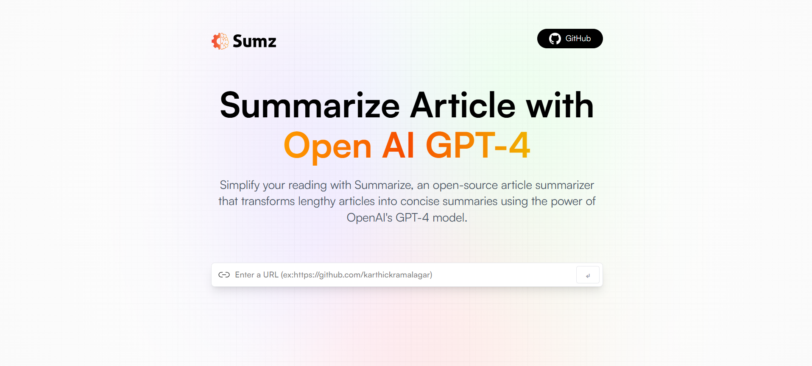

<div align="center">
  <br />
  
  <br />
  <!-- Tech Stack Badges -->
  <div>
    
    
    
    
    
  </div>

  <h3 align="center">📝 AI Summarizer</h3>

  <div align="center">
    Summarize any article or web page instantly using AI! Paste a URL and get a concise summary powered by OpenAI.
  </div>

  <br />
  <div align="center">
    🌐 <strong>Live Demo</strong>: <a href="https://ai-summarizer-service.netlify.app/">ai-summarizer-service.netlify.app</a>
  </div>
  <br />

  <!-- Personal Links -->
  <div align="center">
    <a href="https://github.com/karthickramalagar">
      
    </a>
    <a href="https://linkedin.com/in/karthickramalagar">
      
    </a>
    <a href="mailto:karthickramalagar@gmail.com">
      
    </a>
  </div>
</div>

---

## 📋 Table of Contents

1. [Introduction](#-introduction)  
2. [Tech Stack](#-tech-stack)  
3. [Features](#-features)  
4. [Quick Start](#-quick-start)  
5. [Installation](#-installation)  
6. [License](#-license)  
7. [Acknowledgements](#-acknowledgements)  

---

## 🚀 Introduction

**AI Summarizer** is a modern web application that allows users to quickly summarize articles or web pages using advanced AI models.  
Just paste a URL, and the app fetches the content and provides a concise, easy-to-read summary.  
Built with React, Vite, Tailwind CSS, and Redux Toolkit Query, it offers a fast and responsive user experience.

---

## 🔧 Tech Stack

- ⚡ **Vite** — Lightning-fast build tool  
- ⚛ **React.js** — Component-based UI library  
- 💨 **Tailwind CSS** — Utility-first CSS framework  
- 🟣 **MUI (Material UI)** — Accessible UI components  
- 🟪 **Redux Toolkit Query** — Efficient data fetching  
- 🤖 **OpenAI API** — AI-powered text summarization

---

## ⚙ Features

- 🔗 **Summarize Any URL**: Paste a link and get an instant summary  
- 📝 **History**: View and revisit your previously summarized articles  
- 📋 **Copy to Clipboard**: Easily copy URLs and summaries  
- ⚡ **Fast & Responsive**: Built with Vite, React, and Tailwind  
- 💾 **Local Storage**: Saves your summary history in your browser  
- 🎨 **Modern UI**: Clean, accessible, and mobile-friendly design

---

## ⚡ Quick Start

### Prerequisites

- Node.js  
- npm

### Clone the Repository

```bash
git clone https://github.com/karthickramalagar/ai-summarizer.git
cd ai-summarizer
```
## Install & Run
```cmd
npm install
npm run dev
```
## 🛠️ Installation
Clone the repo
Install dependencies with npm install
Add your OpenAI API key in the appropriate config/service file
Start the development server with npm run dev
Open http://localhost:5173 in your browser
---
## 📄 License
This project is licensed under the MIT License — see the LICENSE file for details.
---
## 🙏 Acknowledgements
.OpenAI
.React
.Vite
.Tailwind CSS
.Redux Toolkit

